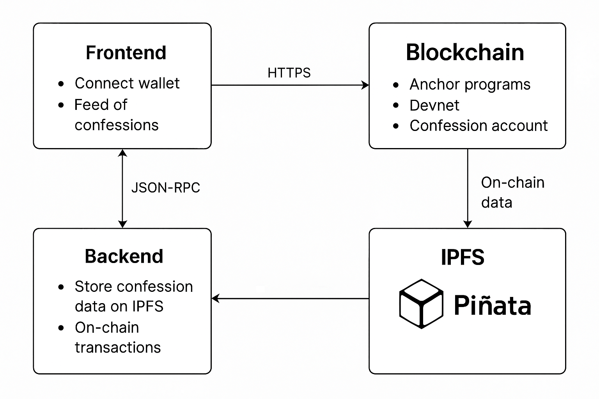

flowchart TD

%% STYLE DEFINITIONS
classDef title fill:#1E293B,stroke:#0EA5E9,color:#fff,font-weight:bold;
classDef box fill:#F8FAFC,stroke:#CBD5E1,stroke-width:1px,color:#1E293B;
classDef external fill:#F1F5F9,stroke:#CBD5E1,color:#334155,stroke-dasharray:3 3;

%% NODES
A[Frontend (Next.js)]:::box
B[Backend API (Node.js / Express)]:::box
C[Solana Program (Anchor, Devnet)]:::box
D[IPFS + Pinata]:::external
E[(User Wallet - Phantom / Solflare)]:::external
F[(Solana RPC Node)]:::external

%% TITLES
subgraph Frontend Layer
A
end

subgraph Off-chain Layer
B
D
end

subgraph On-chain Layer
C
F
end

%% CONNECTIONS
E -->|Connect Wallet| A
A -->|Submit confession (text/image)| B
B -->|Upload content| D
D -->|Return CID| B
B -->|Create Confession Tx (with CID)| A
A -->|Anchor Instruction: create_confession| C
C -->|Store Confession Metadata (author, timestamp, ipfs_uri)| F
A -->|Fetch Confessions via RPC|getConfessions
F -->|Return Confession Accounts| A
A -->|Resolve CID → Fetch content from IPFS| D

%% LABELS
class A,B,C,D,E,F box;

## 🧱 1. Frontend (Next.js + Wallet Integration)

**Purpose:**  
User interface to connect wallet, post confessions, and view feed.

**Tech:**  
Next.js (App Router), TailwindCSS for styling, [`@solana/wallet-adapter`](https://github.com/solana-labs/wallet-adapter) for wallet connection.

**Responsibilities:**
- Connect to Phantom / Solflare wallets.  
- Upload confession text or image to IPFS via backend endpoint.  
- Create confessions on-chain via Anchor client.  
- Fetch on-chain confessions and display feed.  
- Optionally cache or paginate later via indexer.

---

## ⚙️ 2. Backend (Minimal API Layer)

**Purpose:**  
Handle IPFS uploads and help the frontend communicate with the blockchain cleanly.

**Tech:**  
Node.js / Express or Next.js API routes.

**Responsibilities:**
- Accept confession content (text, image) and upload to IPFS via **Pinata SDK** or **web3.storage**.  
- Return the IPFS CID to the frontend.  
- *(Optional)* Expose APIs for listing confessions (from chain or future indexer).

---

## ⛓️ 3. Blockchain Layer (Solana + Anchor Program)

**Purpose:**  
Store confession metadata securely and immutably.

**Tech:**  
Solana Devnet + Anchor Framework.

**Accounts:**
- `ConfessionAccount` — stores author pubkey, timestamp, like/comment counts, and IPFS URI.

**Instructions:**
- `create_confession(ipfs_uri)`  
- `like_confession()`  
- `comment_confession()`

All transactions are signed by user wallets directly — no relayer used in the MVP.

---

## ☁️ 4. IPFS + Pinata (Off-chain Storage)

**Purpose:**  
Store long texts, images, or other confession media off-chain while keeping decentralized accessibility.

**Flow:**
1. Backend uploads confession payload → Pinata → gets CID.  
2. CID (IPFS URI) is stored in the on-chain confession account.  
3. Frontend fetches content via IPFS gateway, e.g.  
   `https://ipfs.io/ipfs/{cid}`.

---

## 📡 5. Solana RPC / Devnet

**Purpose:**  
Blockchain node endpoint to interact with deployed Anchor program.

**Service:**  
Free Solana Devnet RPC or providers like **QuickNode** / **Helius** for stability.

**Usage:**  
Used by both the frontend (Anchor client) and backend to read/write data on-chain.

---

## 🗃️ 6. Indexer / Cache Layer *(Later)*

**Purpose:**  
Optional performance layer for faster feed loading, search, and analytics.

**Stack:**  
Node.js indexer + Postgres (e.g., Supabase).

**Responsibilities:**
- Subscribe to program events or use `getProgramAccounts`.  
- Decode and store accounts in DB for quick queries.  
- Expose REST API endpoints for frontend feed fetching.

---

## 🔁 Data Flow Summary

1. **User connects wallet** → frontend initializes Anchor client.  
2. **User creates confession:**
   - Frontend sends text/image → backend uploads to Pinata → returns IPFS CID.  
   - Frontend calls Anchor `create_confession` with the CID.  
   - Program creates a new Confession account storing metadata + CID.  
3. **Feed fetching:**
   - Frontend fetches all Confession accounts via RPC (`getProgramAccounts`).  
   - Resolves each IPFS CID to get full content.  
4. **Likes / Comments:**
   - Signed transactions call respective Anchor instructions to update counters.

---

